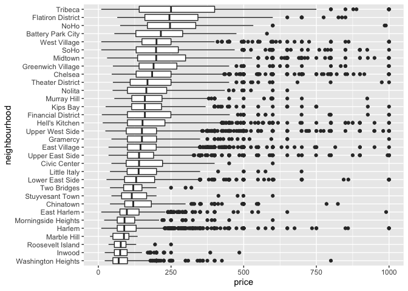

Strings and Factors
================
Molly Martorella
10/15/2019

# Strings:

  - common operations: concatenate, shorten, subset, truncate, replacing
    one string segment with another.
  - stringr package good for majority of string needs.

## Regular Expressions:

  - generic pattern you want to match.

# Factors:

  - categorical label sitting on top of a numerical structure.
  - make a difference when considering: linear models, order of objects
    in your plot.
  - operations: releveling manually or by count or by second variable,
    can rename levels, dropping unused levels, converting to factor
    using as.factor().
  - forcats package.

# Strings and regex

Can do any of this with a dataframe, put it into mutate.

``` r
string_vec = c("my", "name", "is", "jeff")

# str_ prefix --> every function within stringr package will start with this. String is always the first argument in these functions.

# detect a pattern inside of a string (presence or absence, returns a logical):
str_detect(string_vec, "jeff")
```

    ## [1] FALSE FALSE FALSE  TRUE

``` r
#OR can look for partial:
str_detect(string_vec, "je")
```

    ## [1] FALSE FALSE FALSE  TRUE

``` r
#how to detect pattern in df and get index rather than logical?
```

``` r
str_replace(string_vec, "jeff", "Jeff")
```

    ## [1] "my"   "name" "is"   "Jeff"

``` r
str_replace(string_vec, "m", "M")
```

    ## [1] "My"   "naMe" "is"   "jeff"

``` r
string_vec = c(
  "i think we all rule for participating",
  "i think i have been caught",
  "i think this will be quite fun actually",
  "it will be fun, i think"
  )

str_detect(string_vec, "i think")
```

    ## [1] TRUE TRUE TRUE TRUE

``` r
#if want to know which lines start, end, or neither for the desired pattern.
# carrot ^ indicates "starts with"

str_detect(string_vec, "^i think")
```

    ## [1]  TRUE  TRUE  TRUE FALSE

``` r
#$ indicates "ends with"

str_detect(string_vec, "i think$")
```

    ## [1] FALSE FALSE FALSE  TRUE

``` r
string_vec = c(
  "Y'all remember Pres. HW Bush?",
  "I saw a green bush",
  "BBQ and Bushwalking at Molonglo Gorge",
  "BUSH -- LIVE IN CONCERT!!"
  )


# [] to detect any match with capital B or lower case b.

str_detect(string_vec,"[Bb]ush")
```

    ## [1]  TRUE  TRUE  TRUE FALSE

``` r
#notice -- it does not detect BUSH

#[] allows you to give a variety of options, can input ranges of letters, like [A-D].
```

``` r
string_vec = c(
  '7th inning stretch',
  '1st half soon to begin. Texas won the toss.',
  'she is 5 feet 4 inches tall',
  '3AM - cant sleep :('
  )

#if you want a number followed by any letter. 

str_detect(string_vec, "^[0-9][a-zA-Z]")
```

    ## [1]  TRUE  TRUE FALSE  TRUE

``` r
#does not do the same thing:
str_detect(string_vec, "^[0-9][a-z][A-Z]")
```

    ## [1] FALSE FALSE FALSE FALSE

``` r
#this looks for number letter capital letter, rather than number letter (lower or upper).
```

``` r
string_vec = c(
  'Its 7:11 in the evening',
  'want to go to 7-11?',
  'my flight is AA711',
  'NetBios: scanning ip 203.167.114.66'
  )

# period . is used to indicate matching of any character at all:
# only specifies one character though

str_detect(string_vec, "7.11")
```

    ## [1]  TRUE  TRUE FALSE  TRUE

## Special regex characters

period, bracket, (), etc…

Some characters are “special”. These include \[ and \], ( and ), and ..
If you want to search for these, you have to indicate they’re special
using . Unfortunately,  is also special, so things get weird.

``` r
string_vec = c(
  'The CI is [2, 5]',
  ':-]',
  ':-[',
  'I found the answer on pages [6-7]'
  )

# need to indicate [ is now a character and not the beginning of a range. 
# one back slash \ is a special character itself, so need to use double backslash \\ to not use \ special character ability, basically to indicate, escape.

str_detect(string_vec, "\\[")
```

    ## [1]  TRUE FALSE  TRUE  TRUE

``` r
#these end up the same (diff from above though):

str_detect(string_vec, "\\[]")
```

    ## [1] FALSE FALSE FALSE FALSE

``` r
str_detect(string_vec, "\\[\\]")
```

    ## [1] FALSE FALSE FALSE FALSE

``` r
#to detect backslash

str_detect(string_vec, "\\\\")
```

    ## [1] FALSE FALSE FALSE FALSE

``` r
# idk this data won't load

# pulse_data <- 
#   haven::read_sas("public_pulse_data.sas7bdat") %>% 
#   janitor::clean_names() %>% 
#   pivot_longer(bdi_score_bl:bdi_score_12m, 
#                names_to = "visit", 
#                names_prefix = "bdi_score_", 
#                values_to = "bdi") %>% 
#   select(id, visit, everything()) %>% 
#   mutate(visit = str_replace(visit, "bl", "00m"), 
#          visit = fct_relevel(visit, str_c(c("00", "01", "06", "12"), "m"))) %>%
#   arrange(id, visit)
# 
# print(pulse_data, n = 12)
```

``` r
nsduh_url = "http://samhda.s3-us-gov-west-1.amazonaws.com/s3fs-public/field-uploads/2k15StateFiles/NSDUHsaeShortTermCHG2015.htm"

table_marj = 
  read_html(nsduh_url) %>% 
  html_nodes(css = "table") %>% 
  .[[1]] %>%
  html_table() %>%
  slice(-1) %>%
  as_tibble()

#terrible, need to tidy:
#can use regular expressions in contains if you want to.
# separate is going to separate based on where it findas first (

table_marj %>% 
  select(-contains("P Value")) %>% 
  pivot_longer(
    -State,
    names_to = "age_year",
    values_to = "percent"
  ) %>% 
  separate(age_year, into = c("age", "year"), sep = "\\(") %>% 
  mutate(
    year = str_replace(year, "\\)", ""),
    percent = str_replace(percent, "[a-c]$", ""),
    percent = as.numeric(percent)
  )
```

    ## # A tibble: 560 x 4
    ##    State      age   year      percent
    ##    <chr>      <chr> <chr>       <dbl>
    ##  1 Total U.S. 12+   2013-2014   12.9 
    ##  2 Total U.S. 12+   2014-2015   13.4 
    ##  3 Total U.S. 12-17 2013-2014   13.3 
    ##  4 Total U.S. 12-17 2014-2015   12.9 
    ##  5 Total U.S. 18-25 2013-2014   31.8 
    ##  6 Total U.S. 18-25 2014-2015   32.1 
    ##  7 Total U.S. 26+   2013-2014    9.63
    ##  8 Total U.S. 26+   2014-2015   10.2 
    ##  9 Total U.S. 18+   2013-2014   12.9 
    ## 10 Total U.S. 18+   2014-2015   13.4 
    ## # … with 550 more rows

``` r
data_marj <- 
  table_marj %>%
  select(-contains("P Value")) %>%
  pivot_longer(
    -State,
    names_to = "age_year", 
    values_to = "percent") %>%
  separate(age_year, into = c("age", "year"), sep = "\\(") %>%
  mutate(
    year = str_replace(year, "\\)", ""),
    percent = str_replace(percent, "[a-c]$", ""),
    percent = as.numeric(percent)) %>%
  filter(!(State %in% c("Total U.S.", "Northeast", "Midwest", "South", "West")))
```

# Factors

``` r
vec_sex = factor(c("male", "male", "female", "female"))
vec_sex
```

    ## [1] male   male   female female
    ## Levels: female male

``` r
#default uses alphabetical ordering

as.numeric(vec_sex)
```

    ## [1] 2 2 1 1

``` r
vec_sex = relevel(vec_sex, ref = "male")
vec_sex
```

    ## [1] male   male   female female
    ## Levels: male female

``` r
as.numeric(vec_sex)
```

    ## [1] 1 1 2 2

``` r
weather_df <- 
  rnoaa::meteo_pull_monitors(c("USW00094728", "USC00519397", "USS0023B17S"),
                             var = c("PRCP", "TMIN", "TMAX"), 
                             date_min = "2017-01-01", 
                             date_max = "2017-12-31") %>% 
  mutate(name = recode(id, 
                       USW00094728 = "CentralPark_NY", 
                       USC00519397 = "Waikiki_HA", 
                       USS0023B17S = "Waterhole_WA"),
         tmin = tmin / 10,
         tmax = tmax / 10) %>% 
  select(name, id, everything())
```

    ## Registered S3 method overwritten by 'crul':
    ##   method                 from
    ##   as.character.form_file httr

    ## Registered S3 method overwritten by 'hoardr':
    ##   method           from
    ##   print.cache_info httr

    ## file path:          /Users/mollymartorella/Library/Caches/rnoaa/ghcnd/USW00094728.dly

    ## file last updated:  2019-10-01 10:09:07

    ## file min/max dates: 1869-01-01 / 2019-09-30

    ## file path:          /Users/mollymartorella/Library/Caches/rnoaa/ghcnd/USC00519397.dly

    ## file last updated:  2019-10-01 10:09:16

    ## file min/max dates: 1965-01-01 / 2019-09-30

    ## file path:          /Users/mollymartorella/Library/Caches/rnoaa/ghcnd/USS0023B17S.dly

    ## file last updated:  2019-10-01 10:09:19

    ## file min/max dates: 1999-09-01 / 2019-09-30

``` r
#manual releveling:

weather_df %>%
  mutate(name = forcats::fct_relevel(name, c("Waikiki_HA", "CentralPark_NY", "Waterhole_WA"))) %>% 
  ggplot(aes(x = name, y = tmax)) + 
  geom_violin(aes(fill = name), color = "blue", alpha = .5) + 
  theme(legend.position = "bottom")
```

    ## Warning: Removed 3 rows containing non-finite values (stat_ydensity).

<!-- -->

``` r
#releveling factor variable according to the levels of another factor variable:

weather_df %>%
  mutate(name = forcats::fct_reorder(name, tmax)) %>% 
  ggplot(aes(x = name, y = tmax)) + 
  geom_violin(aes(fill = name), color = "blue", alpha = .5) + 
  theme(legend.position = "bottom")
```

    ## Warning: Removed 3 rows containing non-finite values (stat_ydensity).

<!-- -->

``` r
weather_df %>%
  lm(tmax ~ name, data = .)
```

    ## 
    ## Call:
    ## lm(formula = tmax ~ name, data = .)
    ## 
    ## Coefficients:
    ##      (Intercept)    nameWaikiki_HA  nameWaterhole_WA  
    ##           17.366            12.291            -9.884

``` r
weather_df %>%
  mutate(name = forcats::fct_relevel(name, c("Waikiki_HA", "CentralPark_NY", "Waterhole_WA"))) %>% 
  lm(tmax ~ name, data = .)
```

    ## 
    ## Call:
    ## lm(formula = tmax ~ name, data = .)
    ## 
    ## Coefficients:
    ##        (Intercept)  nameCentralPark_NY    nameWaterhole_WA  
    ##              29.66              -12.29              -22.18

``` r
#implicit ordering affects linear model fitting.
```

``` r
data("nyc_airbnb")

# fct_reorder the neighborhood variable according to the price variable.

nyc_airbnb %>%
  filter(neighbourhood_group == "Manhattan") %>% 
  mutate(
    neighbourhood = fct_reorder(neighbourhood, price, na.rm = TRUE)) %>% 
  ggplot(aes(x = neighbourhood, y = price)) +
  geom_boxplot() +
  coord_flip() + 
  ylim(0, 1000)
```

    ## Warning: Removed 109 rows containing non-finite values (stat_boxplot).

<!-- -->

``` r
# coord_flip is easiest way to make boxplot that runs hozizontally rather than vertically. Use ylim to zoom/cut off extreme values.

# VS:

nyc_airbnb %>%
  filter(neighbourhood_group == "Manhattan") %>% 
  ggplot(aes(x = neighbourhood, y = price)) +
  geom_boxplot() +
  coord_flip() + 
  ylim(0, 1000)
```

    ## Warning: Removed 109 rows containing non-finite values (stat_boxplot).

<!-- -->
